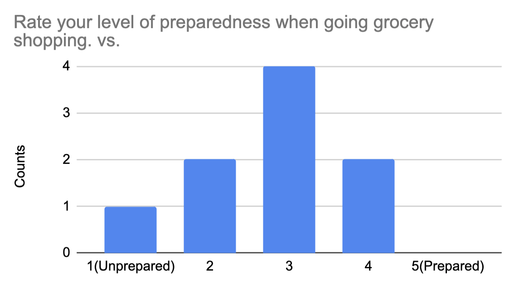
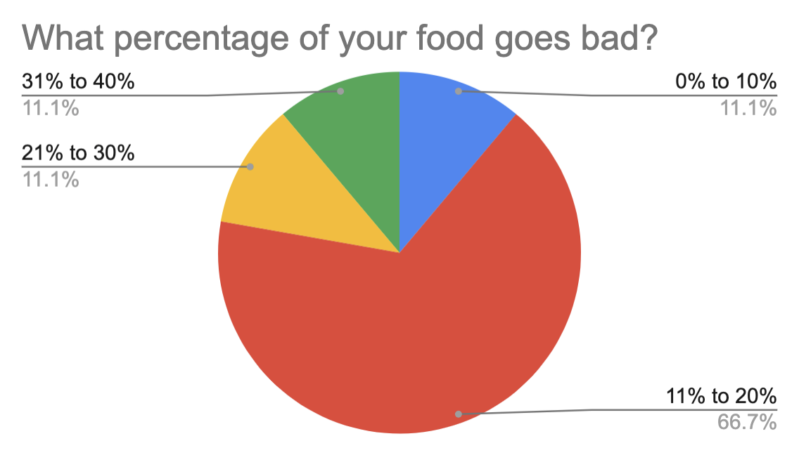
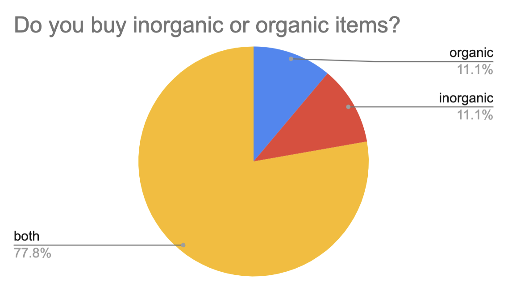
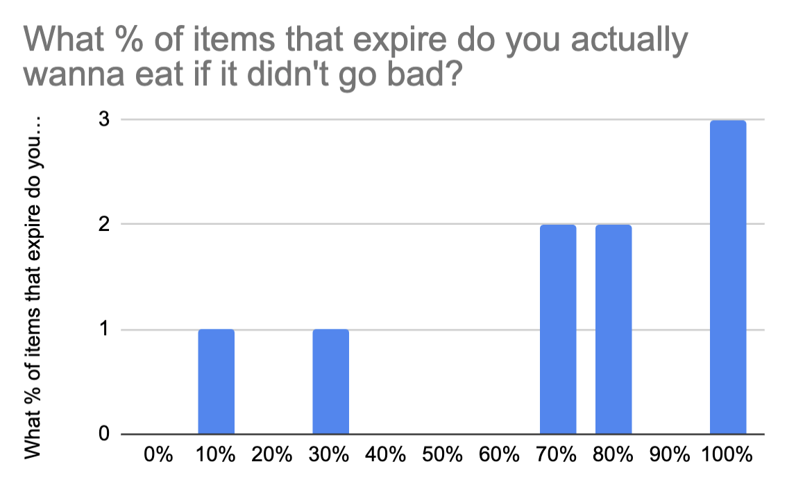
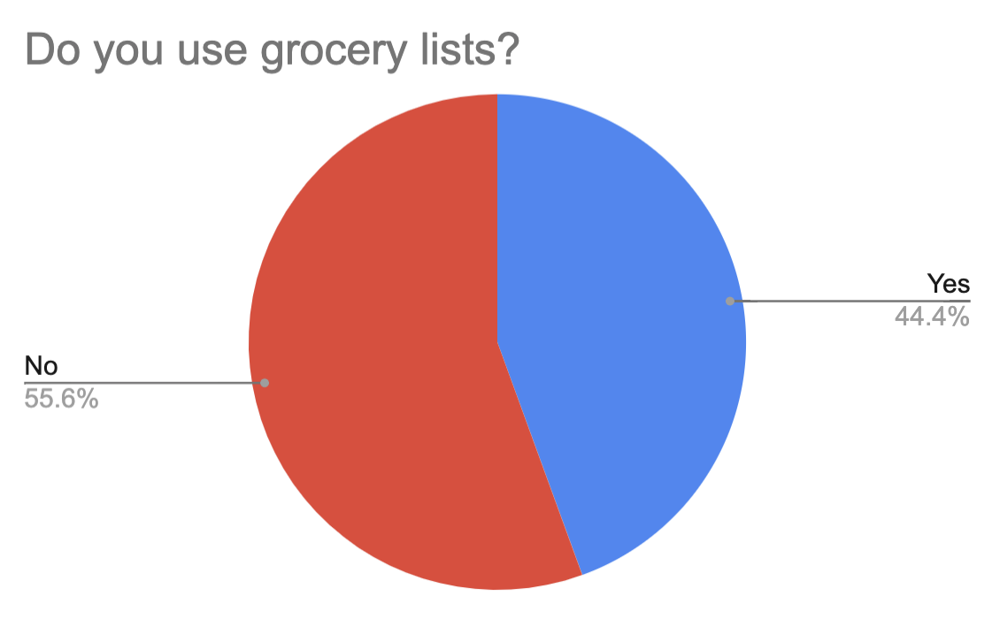
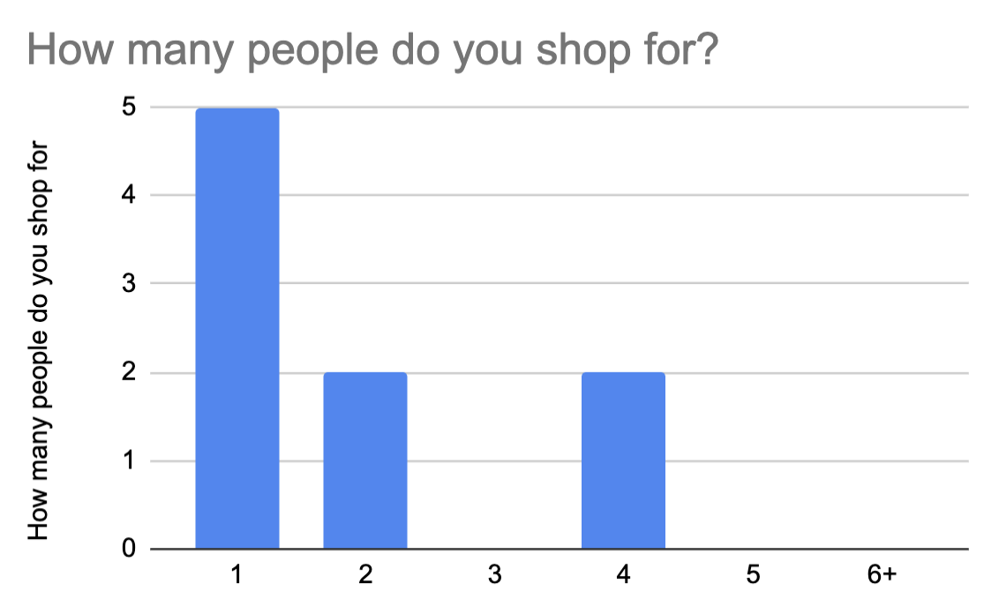
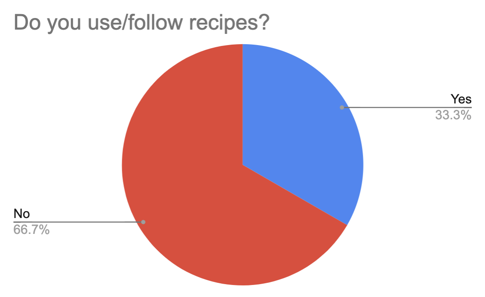
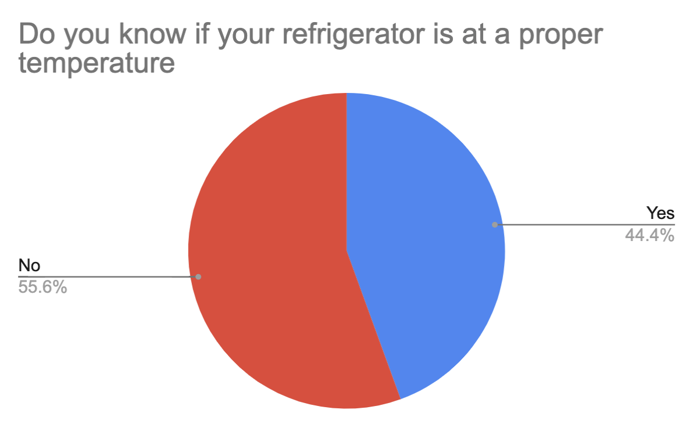
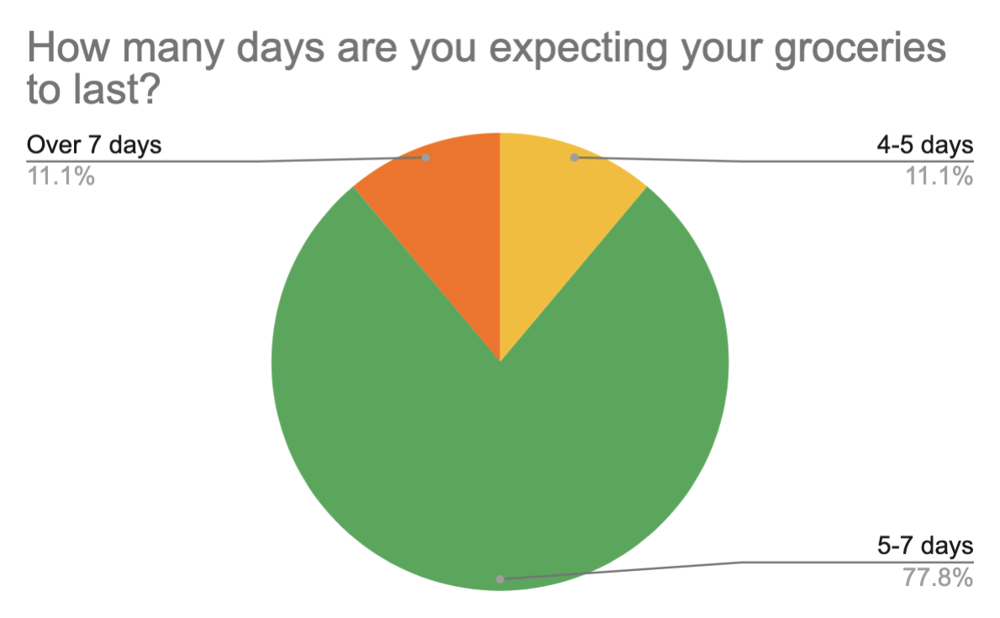
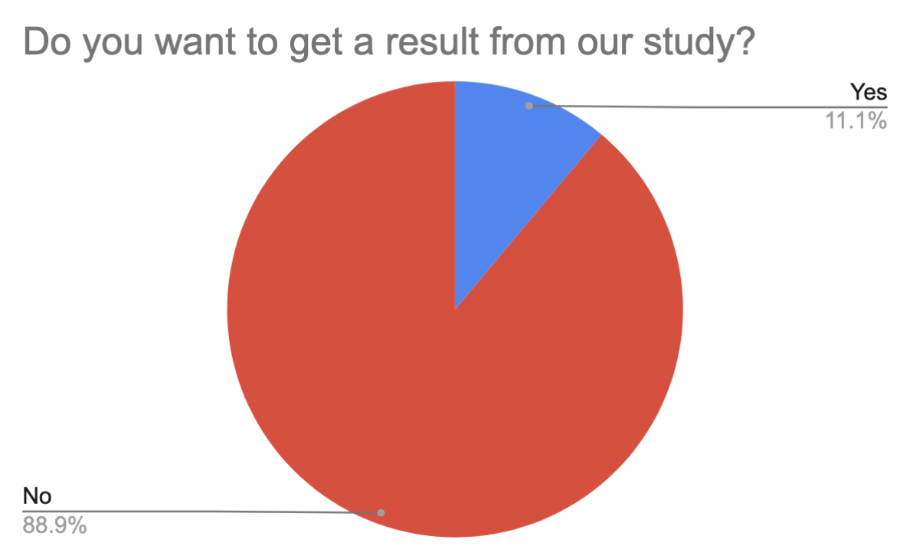

# Neomom, Phase 1: User Inquiry and Inspection

## Methods

We used a survey method so that we could find trends in people’s grocery shopping and usage habits. The survey would provide us with valuable data on if and how people plan for grocery shopping, how many people they shop for, what kind of food do they buy, and how they store their food and if those methods have proven to be effective so far.

The size of the survey group is n=9.

## Findings

For each method, describe the users you collected data from (demographics and how they represent your user base) and summarize the findings point-by-point (for example, the distribution of answers for a multiple-choice question). If you are researching existing software and/or competitor software, you may want to include pictures with call-outs that point out both important features and flaws within the interface.

We collected mock data and reproduced some graphs using the mock data.

What we found:

* Over half of the participants tend to prepare when they go to grocery shopping.

* 66% of participants responded that 11% to 20% of their food goes bad. Almost all participants tend to leave that some of their food goes bad.

* When almost all participants buy groceries, they don't care about them whether groceries are organic or not.

* Almost all participants want to eat expired foods if the foods didn't go bad.

* Over half of the participants don't use a grocery list.

* Almost all participants shop for a small group of families.

* 66% of participants don't use any recipes when they cooking.

* Over half of the participants don't know about their refrigerators are set at appropriate temperatures.

* 77% of participants expected their groceries will be used for 5-7 days. 

* Almost all participants don't want to get a result of our study.

In addition, we found some dairy products, fruits, or groceries are usually expired and responders usually buy these items. Almost the responders stores their food on cabinets or fridges.  One-third of the participants are fellowing Carnivorous diets.

## Conclusions

Discoveries derived from the method(s). For example, explain a requirement (e.g. “Task X needs to be accomplished with fewer steps. . . ”) based on a finding (e.g. “. . . because in our contextual inquiry, we found it was what the users did most often and complained about extraneous work needed to complete it”)

From the findings, we recognize almost all participants waste some of their foods and they don’t use a shopping list when they are shopping. We can help these people through our app since our app provides notifications when they have almost expired foods. To consume almost expired foods, we support a shopping list that can make geat foods with the expired foods. They have some enthusiasm to prepare their shopping, so they can use our shopping list if we provide appropriate items. Almost all participants don’t care whether groceries are organic or not, but we will support an option for that since we respect a small group’s opinion for better shopping. The choice of option will be adopted on our shopping list. 

Almost all responders buy groceries for a small group such as one or two people and they expect their groceries will be expired in 5-7 days. For efficient consuming and less wasted foods, we will provide appropriate amounts of groceries in our shopping list. Also, we plan to send notifications with 5-7 days period. In addition, they are using their own recipes, but we will recommend other recipes with the same ingredients. Through diverse recipes, users can increase satisfaction and more effective consumption. 

Some of the participants don’t know about appropriate temperature of their refrigerators and storing their foods suitably. Also, they tend to want to eat expired foods if the foods look good. Our app will support some great information which is for storing their foods efficiently and safe eating.

## Caveats

Due to the COVID-19 outbreak, students and the general public have been advised to stay indoors for the rest of the Spring 2020 semester. The implications of this were that human experiments were not allowed nor possible. As a result, we resorted to using mock data since it was the next best thing we had access to. 

## Personas

### Chad Frattington
##### Background:
Chad is a 21 year old frat star who believes his body is his temple but doesn't always treat it that way. He regularly drinks with the boys and goes to the gym daily to balance things out. At the end of the day he is all about those gains
##### Habits:
Chad usually shops in bulk in order to feed himself and fraternity brothers. Items include: bulk chicken, protein powder, beef, eggs, a variety of oven/microwave ready meals, and small amounts of fruits. 
##### bad habits: 
Food storage is not one of chads strengths. He often will leave meat in the fridge for weeks, store opened condiments in cabinets

### Vera mccarthy
##### Background: 
Vera is a 19 year old nursing student living on her own for the first time. She just moved into a house with her 3 best friends and started an interest in cooking. She tries to keep a vegetarian diet but occasionally will sneak in a chicken nugget or two. 
##### Habits: 
Pintrist is Vera’s masters chef and she wants to make every recipe that hits the trending page. She exclusively shops at trader joes if she’s not at the farmers market and tries to buy as much organic produce as possible. 
##### Bad habits:
Vera is not very good at remembering what exactly was in the recipes she fell in live with the night before and often buys the wrong ingredients. This causes her to have an excess of food she doesn't know what to do with.

### Chuck Tratotrin
##### Background:
Chuck is a 35 year old small farm owner. He grows a variety of crops on his land and sells a lot of them at the local farmers market. He lives with his new wife who lets him do all the cooking. 
##### Habits:
Chuck mostly eats the food that he grows and will occasionally swap crops at the farmers market to get a larger variety of produce. He also only buys meat at the local butcher shop
##### Bad habits: 
Chuck often makes large amounts of food right before his produce goes bad so he ends up eating the same meal for days on end so he doesn't have to go to a big box super market. 

### Danny 
##### Background:
Danny is a 41 year young mother of 3. She likes to eat healthy and go to hike but often gives into what her kids want to do and eat. She lives with her husband and 3 children in a suburban courtyard outside of the big city. Her and her family rarely eat out due to how expensive it would be. 
##### Habits:
Due to the size of her family, Danny always shops at the discount food store. She brings paper recipes she ripped out of magazines and spends a minimum of an hour shopping. Danny’s shopping cart is always a mix of healthy ingredients and kid Kuisine.
##### Bad Habits:
If there is a coupon out there Danny will use it, but because of that she is often buying food that is closed to expiration. She also buys trending food items she reads about on the opera magazine that she doesn't know what to do with. 

### Eric Christof
##### Background:
Eric is a 30 year old tech startup worker who doesn't really think about what he puts in his body. For most of his meals he eats out or just makes something simple at home. He lives in an apartment with 3 of his employees and spends most of his day at his desk working. He’s reentering the dating game after a tough breakup and is trying to learn how to cook to impress the ladies. 
##### habits: 
When he actually goes grocery shopping he goes to whole foods and buys organic because that is what will impress his date the most. He also will pick up a verity of simple things he know how to cook just in case he dosnt want to leave the house.
##### bad habits:
Often will just throw out the ingredients he bought because his date canceled on him. Never really tries anything other than the food that he knows from his childhood.

## Scenarios

Identify the primary scenarios for your software and for each, include a description that explains who (of your personas) and what they want to do

## Supplementary Materials

Include link(s) or cop(ies) to your instrument(s) itself (questionnaire for a survey, protocol for an interview or contextual inquiry, etc)
