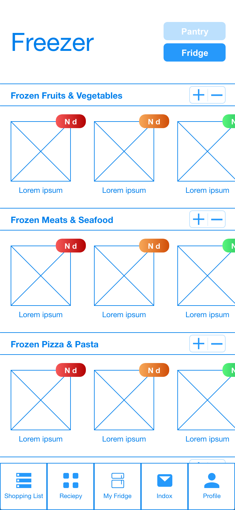
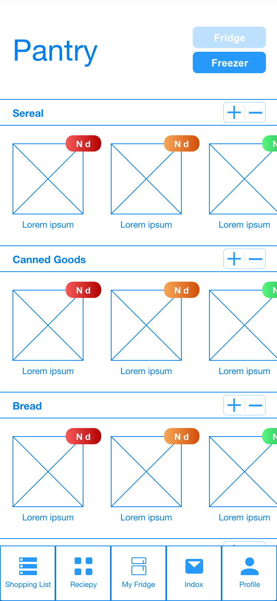
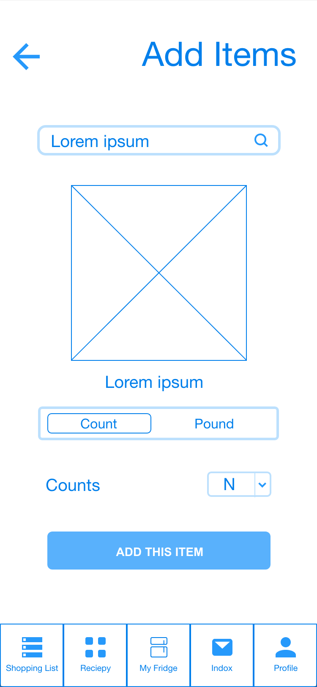
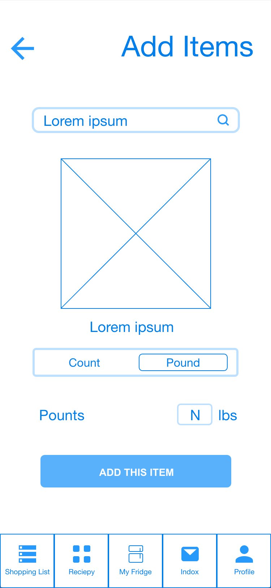

## Phase 2: Interaction Design

*Coming soon*

# Phase II: User-Centered Design

### Prototype: [Neomom](https://xd.adobe.com/view/2631902d-cac1-47dd-5be4-539bd7c1d9d2-5000/)

### Refrigerator
#### Fridge

#### Freezer

#### Pantry

#### Add Items

