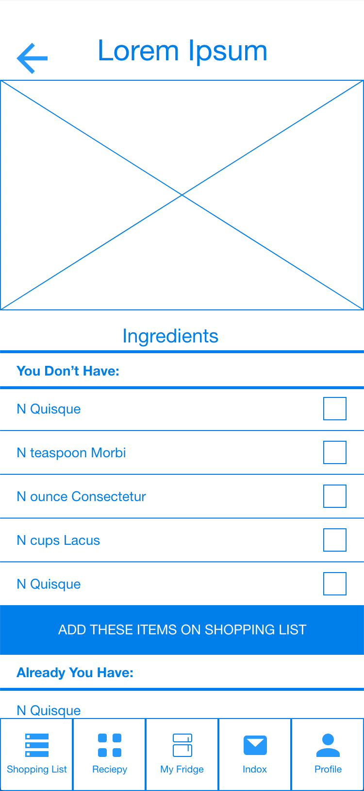

# Phase II: User-Centered Design

### Prototype: [Neomom](https://xd.adobe.com/view/2631902d-cac1-47dd-5be4-539bd7c1d9d2-5000/)

## Refrigerator Section
In the refrigerator section you can view the food items that you currently have. The “My Fridge” tab has 3 sections, Pantry, Fridge, and Freezer to help users better organize their fridges. Within each section there is further organization of product into general types of goods. By default the app will organize the food in these sub categories by numbers of days left before spoiling. In most cases all the food items get automatically added from recipes and grocery lists removed after completing a recipe.

#### Fridge

  

  
  
#### Freezer

  
  
#### Pantry

#### Add Items
Users can manually add items to the “My Fridge” section as well. You will be able to easily look up the item and add the amount in either pounds or total packages. The item will then be automatically added to the the correct fridge categories.

#### Remove Items
Users can easily remove items they used outside of a recipe by pressing and dragging items to the trash bin. The trash bin is only visible when long holding an icon.

## Shopping List Section
The Shopping List section of the app allows users to easily make grocery lists. Items can be automatically added to the shopping list from recipes or be manually added. Instead of just checking off the items users purchase, the app then adds them to the “My Fridge” section.

#### Shopping List
* Shopping List  - 
* Move Items into Refrigerator - 
* Updated Shopping List - 

## Recipe Section
#### Search Recipes
The recipes section allows users to search and save their favorite recipes. There is a Search bar at the top that can pull recipes from a variety of sources has special filtering settings. Using the filter users can search for recipes that include food that they already have all the ingredients for. They could also easily find recipes for the food items that might be expiring soon. Users can also make custom dietary filters to permanently remove suggestions to non-compliant recipes. All favorited recipes will show up in the section under the search bar for easy access.

#### Recipe's Ingredients
When looking at a recipe, users can see all ingredients they have as well as the ones they need to buy. The ones that they need to buy can be added to the shopping cart with one tap.

#### Recipe's Directions
Recipe directions are formatted in a step by step way to ease users though the cooking process. Recipes also include adjustments for how many people the user is cooking. 

## Inbox Section
#### Inbox with Sesarch Bar
* Inbox - 
* Search Bar - 
* Hide Notification - 

#### Food Warning Notification of Inbox
The food warning notification will let users know when food items are expiring. It will also recommend recipes that contain the item.

#### Infomation Notification of Inbox

## Profile Section
The profile section offers analytical data on the food users purchase consume and waste. It brakes this information down into a pie graph for the current month and a total waste line graph at the bottom. The pie graph is split into food categories to offer users insight on what food items they let go bad the most often. The line graph helps users visualize how wasteful they have been to better adjust their shopping in the future.
#### Profile with Food Wasting Analysis

